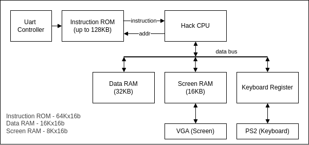
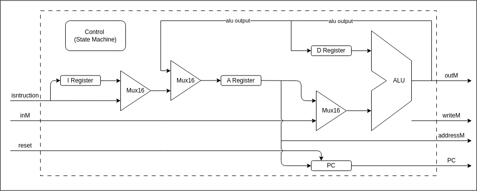

# Hack-on-FPGA

- [Hack-on-FPGA](#hack-on-fpga)
  - [Overview](#overview)
  - [Motivation](#motivation)
  - [Hack CPU Architecture](#hack-cpu-architecture)
    - [Hack Platform](#hack-platform)
    - [Hack CPU on FPGA](#hack-cpu-on-fpga)
  - [Supported FPGA Boards](#supported-fpga-boards)
  - [Repository Structure](#repository-structure)


(This README file is created with the help of ChatGPT and DeepSeek!)

**Hack-on-FPGA** is a collection of implementations of the [Nand2Tetris](https://www.nand2tetris.org/) Hack CPU on various FPGA platforms.

## Overview

The Hack CPU is a simple 16-bit processor introduced in the Nand2Tetris course.
It supports a minimal instruction set and a Harvard architecture.
This project implements the Hack CPU using hardware description languages (HDLs) and deploys it to multiple FPGA boards.

## Motivation

Make the Hack CPU more fun and enjoy it in the read hardware!

## Hack CPU Architecture

The original Hack CPU Architecture can be found in the nand2tetris website [Lecture 5 Computer Architecture](https://drive.google.com/file/d/1Z_fxYmmRNXTkAzmZ6YMoX9NXZIRVCKiw/view). It is modified to make it suitable for FPGA implementation.


### Hack Platform



- Uart Controller: Programs the Instruction ROM and control the Hack CPU
- Instruction ROM: Store the program instruction
- Hack CPU: The Hack CPU
- Data RAM: Store the data portion (Memory[0:16383])
- Screen RAM: Store the data portion (Memory[16384:24479])
- Keyboard Register: Store the keyboard Scancode (Memory[24576])
- VGA: VGA controller
- PS2: PS2 keyboard controller

### Hack CPU on FPGA

Here is the Hack CPU Design for FPGA:



The Hack CPU consist of the following components:
- ALU: Responsible for performing the logic and arithmetic computation
- A Register
- D Register
- I Register: Hold the current instruction in case of stall
- PC: Program Counter
- Control: State Machine Controlling the CPU

Compared to the original Nand2Tetris Hack CPU, there are two new components: *Control* block and *I Register + MUX*.
They are introduced to accommodate FPGA design.

#### Async Memory and Sync Memory

The Nand2Tetris Course, the RAM and ROM are implemented as asynchronous and the read data is returned in the same
clock However, in FPGA, most of the RAM are implemented as synchronous RAM (BRAM), and data is returned in the next cycle.
This have two impact on the current Hack CPU design:

1. The Instruction corresponding to the current PC will return at the next clock cycle.
2. The memory read data will return at the next clock cycle.

The original Hack CPU design needs to be modified to accommodate the above impacts.

#### CPU Control State Machine

In order to solve the above issue, we will use a state machine to control the CPU and make it a "multi-cycle" CPU.

The CPU contains 3 states IDLE, Fetch, and EXEC:

| State | Meaning                            |
| ----- | ---------------------------------- |
| IDLE  | CPU under reset                    |
| FETCH | Fetch the instruction from the ROM |
| EXEC  | Execute the instruction            |

For Instruction Fetch, CPU will access the Instruction ROM in the *FETCH* state and the instruction will come back at
*EXEC* stage. CPU can start executing the instruction in *EXEC* stage.

For Memory Read, since the A register is updated to the new value at the beginning of the *FETCH* state, this will set
the RAM address to a new value and start accessing the RAM implicitly. When CPU switch to *EXEC* stage, the read data
will be available at RAM output.

This solution only works when the memory has a **FIXED 1 CYCLE READ LATENCY**. If the read latency is more then 1 cycle
or arbitrary, then a new solution will be needed.

## Supported FPGA Boards

| Board | Vendor | Toolchain | Status |
| ----- | ------ | --------- | ------ |

## Repository Structure

```
Hack-on-FPGA
├── boards              // Board-specific constraints and build scripts
├── docs
├── LICENSE
├── program             // various Jack program
├── README.md
├── rtl                 // RTL source file
│   ├── cpu             // Hack CPU
│   ├── memory          // RAM and ROM module
│   ├── peripherals     // Peripherals devices
│   └── top             // Top level module
└── software            // Jack/Hack software tool chain
```