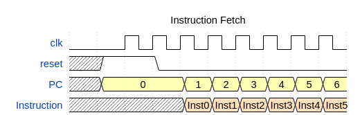
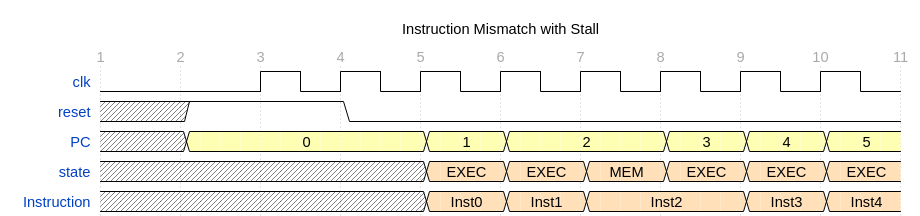

# Hack-on-FPGA

- [Hack-on-FPGA](#hack-on-fpga)
  - [Overview](#overview)
  - [Motivation](#motivation)
  - [Hack CPU Architecture](#hack-cpu-architecture)
    - [Hack Platform](#hack-platform)
    - [Hack CPU on FPGA](#hack-cpu-on-fpga)
  - [Supported FPGA Boards](#supported-fpga-boards)
  - [Repository Structure](#repository-structure)


(This README file is created with the help of ChatGPT and DeepSeek!)

**Hack-on-FPGA** is a collection of implementations of the [Nand2Tetris](https://www.nand2tetris.org/) Hack CPU on various FPGA platforms.

## Overview

The Hack CPU is a simple 16-bit processor introduced in the Nand2Tetris course.
It supports a minimal instruction set and a Harvard architecture.
This project implements the Hack CPU using hardware description languages (HDLs) and deploys it to multiple FPGA boards.

## Motivation

Make the Hack CPU more fun and enjoy it in the read hardware!

## Hack CPU Architecture

The original Hack CPU Architecture can be found in the nand2tetris website [Lecture 5 Computer Architecture](https://drive.google.com/file/d/1Z_fxYmmRNXTkAzmZ6YMoX9NXZIRVCKiw/view). It is modified to make it suitable for FPGA implementation.


### Hack Platform


- Uart Controller: Programs the Instruction ROM and control the Hack CPU
- Instruction ROM: Store the program instruction
- Hack CPU: The Hack CPU
- Data RAM: Store the data portion (Memory[0:16383])
- Screen RAM: Store the data portion (Memory[16384:24479])
- Keyboard Register: Store the keyboard Scancode (Memory[24576])
- VGA: VGA controller
- PS2: PS2 keyboard controller

### Hack CPU on FPGA

Here is the Hack CPU Design for FPGA:


The Hack CPU consist of the following components:
- ALU: Responsible for performing the logic and arithmetic computation
- A Register
- D Register
- I Register: Hold the current instruction in case of stall
- PC: Program Counter
- Control: State Machine Controlling the CPU

Compared to the original Nand2Tetris Hack CPU, there are two new components: *Control* block and *I Register + MUX*.
They are introduced to accommodate FPGA design.

#### Async Memory and Sync Memory

The Nand2Tetris Course, the RAM and ROM are implemented as asynchronous and the read data is returned in the same
clock However, in FPGA, most of the RAM are implemented as synchronous RAM (BRAM), and data is returned in the next cycle.
This have two impact on the current Hack CPU design:

1. The Instruction corresponding to the current PC will return at the next clock cycle.
2. The memory read data will return at the next clock cycle.

The original Hack CPU design needs to be modified to accommodate the above impacts.

#### Instruction Fetch

There is no explicit change required for instruction fetch logic using synchronous RAM. The instruction will return in
tne next clock cycle. The current PC value in PC register indicate the address of next instruction to be fetched.




#### Memory Read

With synchronous RAM, memory read will take 2 clock cycles. Since the A register is updated at the end of current clock,
if the next instruction involves memory read (for example `D=M`), the read data will not be available at this clock.

In order to overcome is gap, we make the instruction that involves memory read from 1 clock cycle to 2 clock cycle and
introduces a state machine to control the cpu.

The state machine contains 2 states: EXECUTE, MEM_READ. When the current instruction requires a memory read, we stall
the CPU for one clock cycle and wait for the read data to come back in the next cycle.

| State    | Meaning                              |
| -------- | ------------------------------------ |
| EXECUTE  | Execute instructions or read memory  |
| MEM_READ | Use memory read data for calculation |

However, this create another issue regarding the instruction. When previous instruction completes, the PC value will be
update to the address of next instruction. When we enter EXECUTE state for the next instruction, the CPU will fetch the next instruction from instruction rom and the new instruction will return at MEM_READ state. This will interfere with
the current instruction.



At cycle 7, instruction will change to instruction2 instead of keeping as instruction1.

In order to fix the issue, we add retention register to keep the current instruction and use a MUX to select it.

## Supported FPGA Boards

| Board | Vendor | Toolchain | Status |
| ----- | ------ | --------- | ------ |

## Repository Structure

```
Hack-on-FPGA
├── boards              // Board-specific constraints and build scripts
├── docs
├── LICENSE
├── program             // various Jack program
├── README.md
├── rtl                 // RTL source file
│   ├── cpu             // Hack CPU
│   ├── memory          // RAM and ROM module
│   ├── peripherals     // Peripherals devices
│   └── top             // Top level module
└── software            // Jack/Hack software tool chain
```