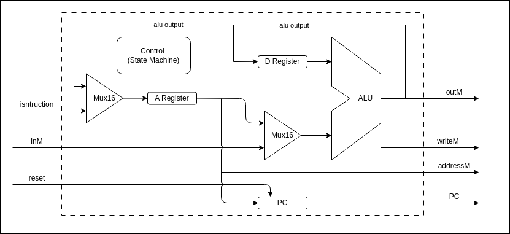

# Hack-on-FPGA

(This README file is created with the help of ChatGPT and DeepSeek!)

**Hack-on-FPGA** is a collection of implementations of the [Nand2Tetris](https://www.nand2tetris.org/) Hack CPU on various FPGA platforms.

## Overview

The Hack CPU is a simple 16-bit processor introduced in the Nand2Tetris course.
It supports a minimal instruction set and a Harvard architecture.
This project implements the Hack CPU using hardware description languages (HDLs) and deploys it to multiple FPGA boards.

## Motivation

Make the Hack CPU more fun and enjoy it in the read hardware!

## Hack CPU Architecture

The original Hack CPU Architecture can be found in the nand2tetris website [Lecture 5 Computer Architecture](https://drive.google.com/file/d/1Z_fxYmmRNXTkAzmZ6YMoX9NXZIRVCKiw/view). It is modified to make it suitable for FPGA implementation.


### Hack Platform


- Uart Controller: Programs the Instruction ROM and control the Hack CPU
- Instruction ROM: Store the program instruction
- Hack CPU: The Hack CPU
- Data RAM: Store the data portion (HackRAM[0:16383])
- Screen RAM: Store the data portion (HackRAM[16384:24479])
- Keyboard Register: Store the keyboard Scancode (HackRAM[24576])
- VGA: VGA controller
- PS2: PS2 keyboard controller

### Hack CPU



(From nand2tetris slides)


## Supported FPGA Boards


| Board       | Vendor  | Toolchain     | Status    |
| ----------- | ------- | ------------- | --------- |

## Repository Structure

```
Hack-on-FPGA
├── boards              // Board-specific constraints and build scripts
├── docs
├── LICENSE
├── program             // various Jack program
├── README.md
├── rtl                 // RTL source file
│   ├── cpu             // Hack CPU
│   ├── memory          // RAM and ROM module
│   ├── peripherals     // Peripherals devices
│   └── top             // Top level module
└── software            // Jack/Hack software tool chain
```