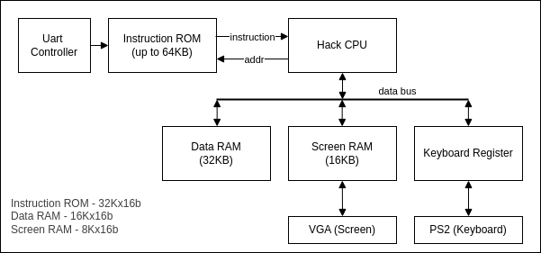

# Hack-on-FPGA

- [Hack-on-FPGA](#hack-on-fpga)
  - [Overview](#overview)
  - [Motivation](#motivation)
  - [Hack CPU Architecture](#hack-cpu-architecture)
    - [Hack Platform](#hack-platform)
    - [Hack CPU on FPGA](#hack-cpu-on-fpga)
  - [Repository Structure](#repository-structure)
  - [Supported FPGA Boards](#supported-fpga-boards)
  - [Try it on FPGA](#try-it-on-fpga)
    - [Load a Jack Program](#load-a-jack-program)
    - [Programming the FPGA](#programming-the-fpga)


**Hack-on-FPGA** is a collection of implementations of the [Nand2Tetris](https://www.nand2tetris.org/) Hack CPU for various FPGA platforms.

## Overview

The Hack CPU is a 16-bit processor introduced in the Nand2Tetris course. It supports a minimal instruction set and Harvard architecture.

This project reimplements the Hack CPU in Verilog (HDL), adapted for real-world FPGA boards, and extends the system to support VGA and keyboard I/O.

## Motivation

Bring the Hack CPU to life on physical FPGA hardware — for fun, learning, and experimentation.

## Hack CPU Architecture

The Hack CPU design in this repository is based on the [Nand2Tetris Computer Architecture](https://drive.google.com/file/d/1Z_fxYmmRNXTkAzmZ6YMoX9NXZIRVCKiw/view), with modifications to better suit FPGA implementation constraints.

### Hack Platform



- Instruction ROM: Store Hack instruction
- Hack CPU: The Hack processor.
- Data RAM: Store the data portion `RAM[0:16383]`
- Screen RAM: Store the data portion `RAM[16384:24575]`
- Uart Controller: Load hack program
- Keyboard Register: Store the current key code at `RAM[24576]`
- VGA Controller: Generates VGA output.
- PS2 keyboard controller: Interfaces with a PS2 keyboard.

### Hack CPU on FPGA

Here is the Hack CPU Design for FPGA:


The Hack CPU consist of the following components:
- ALU: Responsible for performing the logic and arithmetic computation.
- A Register, D Register: Standard Hack CPU register.
- PC (Program Counter): Tracks instruction location.
- Control: A Finite State Machine managing CPU states.

Additional components such as the **Control FSM** and **I Register** were added to accommodate synchronous memory in FPGA.

#### Async vs. Sync Memory

In the Nand2Tetris course, ROM and RAM behave as asynchronous memory - data is returned in the same clock cycle.
However, most FPGA RAMs (e.g., BRAM) are synchronous: data is returned in the next clock cycle.

This has two implications:
1. Instruction fetched from ROM becomes available one cycle after the PC is issued.
2. Data read from RAM also returns one cycle later.

#### CPU Control State Machine

To handle sync memory, the CPU uses a three-state FSM (Finite State Machine):

| State | Meaning                            |
| ----- | ---------------------------------- |
| IDLE  | CPU in reset state                 |
| FETCH | Fetch the instruction from the ROM |
| EXEC  | Execute the instruction            |

- During `FETCH`, the instruction is loaded from ROM.
- `A` register specific the RAM address in `FETCH` state and the RAM data is available in `EXEC` state
- In `EXEC`, the instruction is executed and RAM output becomes valid.
- This approach assumes fixed 1-cycle latency memory. For longer or variable latency, further changes are required.

## Repository Structure

```
Hack-on-FPGA
├── boards              // Board-specific build scripts and constraints
├── docs
├── LICENSE
├── program             // Sample Jack programs + UART load script
├── README.md
├── rtl                 // RTL design file
│   ├── cpu             // Hack CPU Core
│   ├── memory          // RAM/ROM module
│   ├── vga             // VGA
│   ├── uart            // UART
│   └── top             // Top level module
└── software            // Jack/Hack software tool chain
```

## Supported FPGA Boards

| Board   | Vendor | Toolchain | Status                                   |
| ------- | ------ | --------- | ---------------------------------------- |
| Arty A7 | Xilinx | Vivado    | Mostly Supported except for keyboard     |
| DE2     | Altera | Quartus   | Not Supported - insufficient on-chip RAM |

## Try it on FPGA

### Load a Jack Program

After program the FPGA, load a `.hack` program using the UART Host script.

- Config the `com_port` in `config.yaml`
- Run the `UartHost.py` script to enter UART Shell:

```shell
cd program
sudo python3 UartHost.py
```

In the UART Shell:

```shell
> program 0 <hack file>
```

**Available Programs:**

- `ScreenTest.hack`: Draw a simple image on screen.
- `Pong.hack`: Classic Pong game (run very fast).

### Programming the FPGA

#### Arty A7

- Requires the Digilent PmodVGA module (connected to JA/JB)

```shell
cd fpga/arty/
make pgmonly
```
